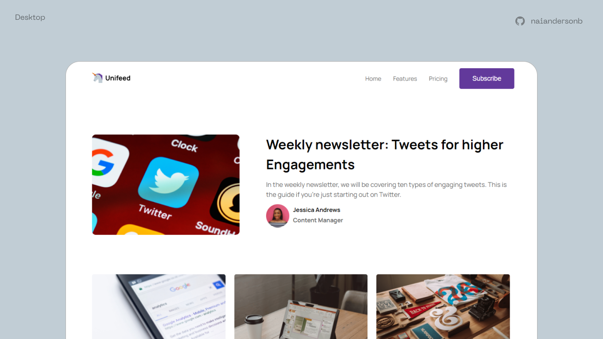
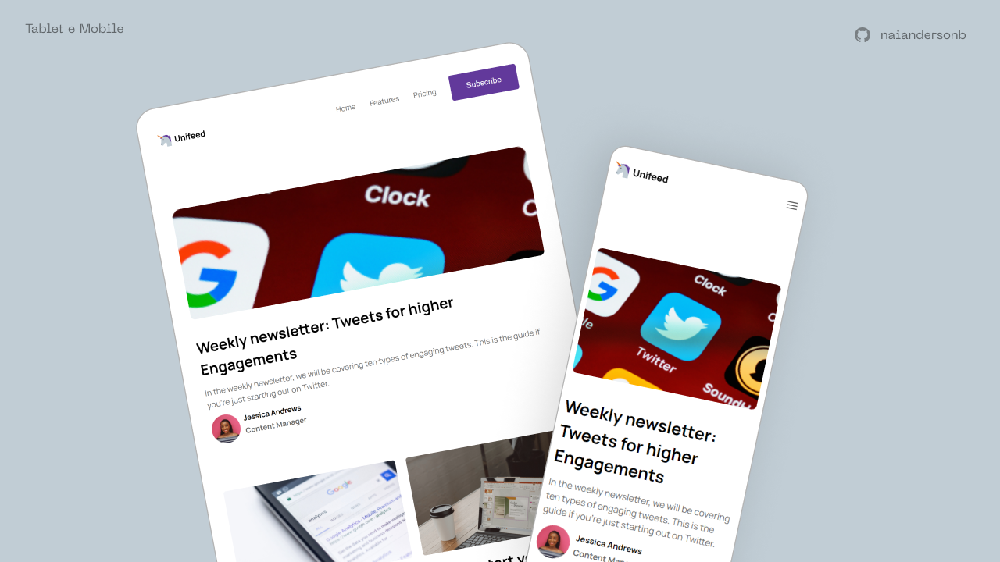

## Sobre o projeto

Challenge proposed by [Codewell.com](https://www.codewell.cc/). The project consisted of developing a responsive blog homepage. [See more about the challenge here](https://www.codewell.cc/challenges/unifeed-blog-page--608d9d5c747bad001532bd7c).

## Screenshots

#### Desktop

---
<h3 align="center"> ⚡️ live demo: <a href='https://unifeedblog.netlify.app/'> Unifeed </a> </h3>

---

### Technologies

- [React.JS](https://reactjs.org/)
- [SASS](https://sass-lang.com/)
- [CSS Grid Layout](https://developer.mozilla.org/en-US/docs/Web/CSS/CSS_Grid_Layout)
- [Typescript](https://www.typescriptlang.org/)

## How to start the project

- Clone the project:

  `git clone https://github.com/naiandersonb/Unifeed.git`

- Install NPM packages:

  `npm install`

- Start the project:

  `npm start`

  or

  `yarn start`

## About me:
- Instagram - [@naiandersonbruno_](https://www.instagram.com/naiandersonbruno_/)
- Linkedin - [Naianderson Bruno](www.linkedin.com/in/naianderson-bruno-franca)
